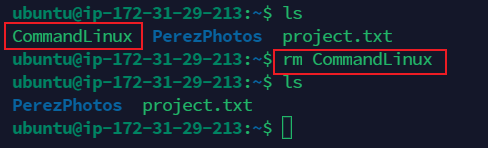
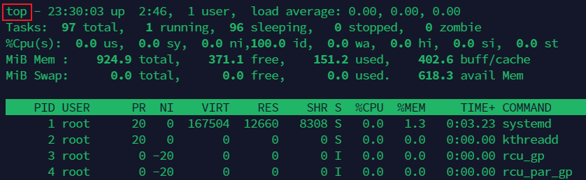
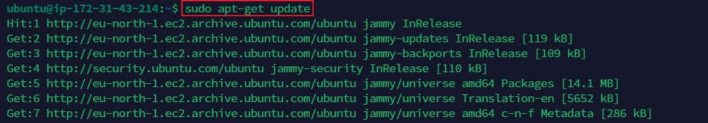

# Linux Practice Project

In this project I will be implementing various linux commands

## 1. sudo apt upgrade command
`sudo apt upgrade` is a Linux command that updates all installed software packages to their latest versions for improved functionality and security. The sudo command gives you superuser privileges, allowing you to execute administrative tasks.

## 2. pwd command
`pwd` is a Linux command that stands for "print working directory." It shows the current directory or folder path in the terminal.

## 3. cd command
`cd` is a Linux command used to change the current directory in the terminal.

## 4. ls command
- `ls`: Lists files and directories in the current directory.

- `ls -a`: Lists all files, including hidden ones (those starting with a dot).
- `ls -r`: Lists files in reverse order.
- `ls -lh`: Lists files with detailed information, including human-readable file sizes.

## 5. cat command
`cat` is a Linux command used to display the content of a file in the terminal.

## 6. cp command
`cp` is a Linux command used to copy files and directories from one location to another.

## 7. mv command
`mv` is a Linux command used to move files and directories from one location to another or to rename files and directories.

## 8. mkdir command
`mkdir` is a Linux command used to create new directories (folders) in the file system.

## 9. rmdir command
The `rmdir` command in Linux is used to remove empty directories (folders) from the file system.

## 10. rm command
The `rm` command in Linux operating systems is used to remove or delete files and directories.

## 11. touch command
The `touch` command in linux operating system is used to create empty files.

## 12. locate command
The `locate` command is used to quickly find the location of files on the filesystem.

## 13. find command
The `find` command is  used to search for files and directories within a specified location.

## 14. grep command
The `grep` command is used to search for specific patterns or text within files or streams of text.

## 15. df -h command
The `df -h` command is used to display disk space usage in a human-readable format.

## 16. du command
The `du` command is used to estimate the space used by a directory or a file.

## 17. head command
The `head` command is used to display the beginning lines of a text file. By default, it prints the first 10 lines of each specified file to the standard output.

## 18. tail command
The `tail` command is used to display the last lines of a text file. By default, it prints the last 10 lines of each specified file to the standard output.

## 19. diff command
The `diff` command is used to compare the contents of two text files line by line.

## 20. tar command
`tar` is a command used for archiving files and directories into a single file.

## 21. chmod command
`chmod` is a command that stands for "change mode." It is used to change the permissions of a file or directory, specifying who can read, write, or execute it.

## 22. chown command
`chown` is a command that stands for "change owner." It is used to change the user and/or group ownership of files and directories.

## 23. jobs command
`jobs` command is used to display a list of currently running jobs in the background, as well as jobs that are stopped or suspended.

## 24. kill command
The kill command is used to terminate or send signals to processes. It allows users to manage running processes by stopping them, restarting them, or completely ending their execution.

## 25. ping command
`ping` is a network utility command used to test the reachability of a host on an Internet Protocol (IP) network.

## 26. wget command
`wget` is a command used to download files from the web.

## 27. uname command
The `uname` command is used to obtain information about the system and its kernel.

## 28. top command
The `top` command is used to provide real-time information about the processes running on a system. It allows users to monitor system performance, view running processes, and manage system resources.

## 29. history command
The `history` command is used to view and manipulate the command history list.

## 30. man command
The `man` command is used to display the manual pages (documentation) for various commands, functions, and system calls.

## 31. echo command
The `echo` command is used to display text or print messages to the terminal or other output devices.

## 32. zip command
`zip` and `unzip` are commands used for compressing and decompressing files and directories, respectively. The `zip` command is used to compress one or more files or directories into a single compressed archive file. The `unzip` command is used to extract the contents of a compressed archive file.

## 33. hostname command
`hostname` refers to the unique label assigned to a device (typically a computer) that is connected to a network and uses the Internet Protocol for communication. The `hostname -i` is used to obtain the IP address associated with the current host or system.

## 34. useradd & passwd command
`useradd` and `passwd` are commands used for creating new user accounts and setting passwords for these accounts, respectively.

## 35. apt-get command
`apt-get` is used to handle packages (software installations, upgrades, and removals) on the system.

## 36. nano command
`nano` is used for quickly editing configuration files, scripts, or any other plain text files.

## 37. alias command
`alias` is used to create a custom shorthand or replacement for a longer command or series of commands.

## 38. su command
The `su` command, short for "switch user" or "superuser," is used to change the current user to another user without logging out. It allows a user to assume the identity of another user, often the superuser or root user, with the ability to execute commands and access files owned by that user.

## 39. htop command
`htop` is an interactive system monitoring process viewer for providing a more user-friendly and feature-rich interface to monitor system resources and manage running processes.

## 40. ps command
ps is a command that is used to provides information about the currently running processes. It stands for "process status." When executed, ps displays a snapshot of the active processes on your system.
