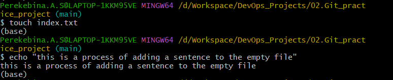
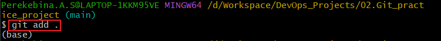
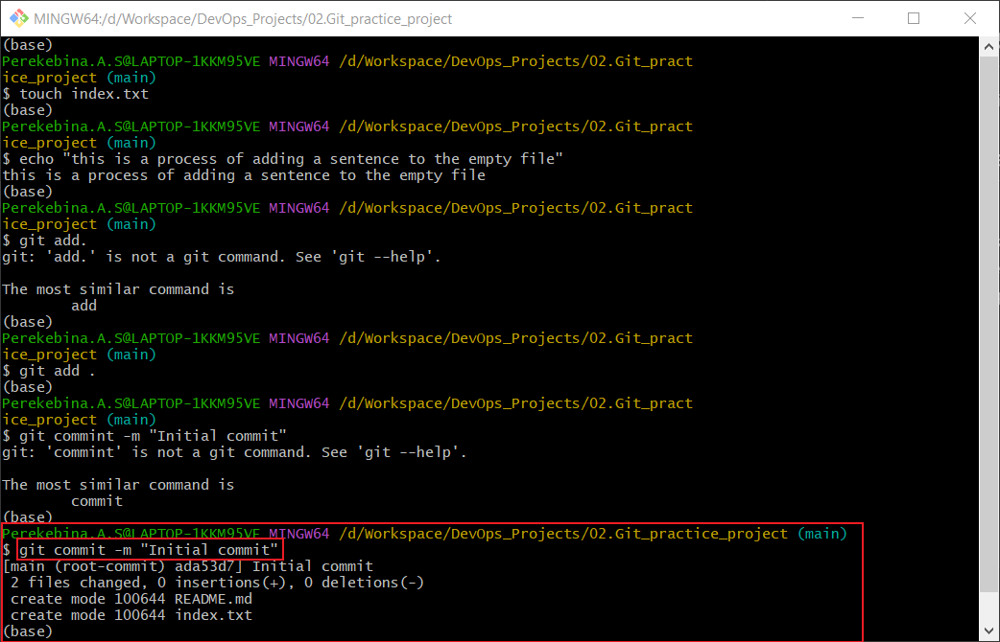
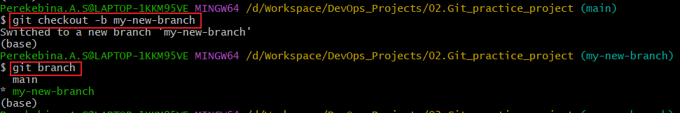
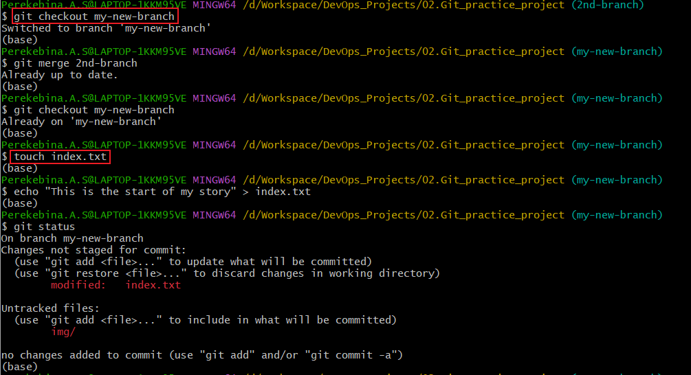
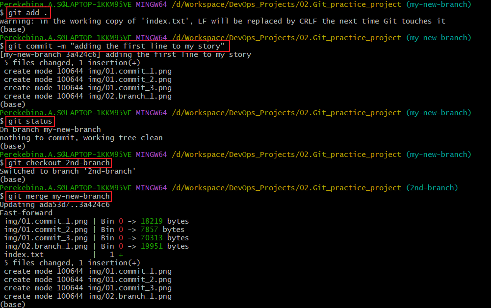
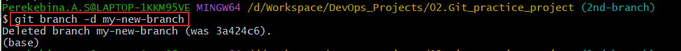

# Git practice project

In this project I will be implementing various linux commands on git.

## 01. Initializing a Repository and Making Commits
Initializing a repository in Git involves setting up a new or existing project directory as a Git repository. This process creates a hidden subfolder within your project that houses the internal data structure required for version control. Commits in Git are snapshots of your project at a specific point in time.

## 02. Working with Branches
In Git, branches are used to isolate work in progress from the main project. After creating the branch, you can make changes, add commits, and perform other operations specific to this branch. After the changes have been made, in can be merged to a different branch using the merge command. After merging the branches, the other branch is normally deleted using git branch -d

## 03. Collaboration and Remote Repository

