# WEB STACK IMPLEMENTATION (LEMP Stack)
## Welcome to the LEMP Stack Experience!
The LEMP stack, an acronym for Linux, Nginx, MySQL, and PHP/Python/Perl, represents a robust and versatile web development environment. It's a powerful combination that forms the backbone of countless websites and applications, offering a streamlined architecture for building, deploying, and scaling web projects.
### Breaking it Down:
- Linux: Serving as the foundational operating system, Linux provides a stable and secure environment for hosting your applications.

- Nginx: This high-performance web server is renowned for its speed and efficiency, handling concurrent connections with ease. 

- MySQL: As a relational database management system, MySQL is a reliable choice for storing and retrieving data. Its robust features make it a go-to solution for web applications requiring efficient and organized data management.

- PHP/Python/Perl: LEMP allows flexibility in server-side scripting with PHP being the most common, while Python and Perl are powerful alternatives. These scripting languages enable dynamic content generation, making your web applications come to life. In this project I will be using PHP.

Explore this repository to kickstart your journey with the LEMP stack.

## Getting Started:
The AWS Management Console is used to to launch an Ubuntu EC2 instance. A key pair is created for secure SSH access.
SSH Connection. Git Bash is used to secure communication between your local machine and the EC2 instance using the key file and instance IP.

`ssh -i lemp_key.pem ubuntu@16.170.214.144`
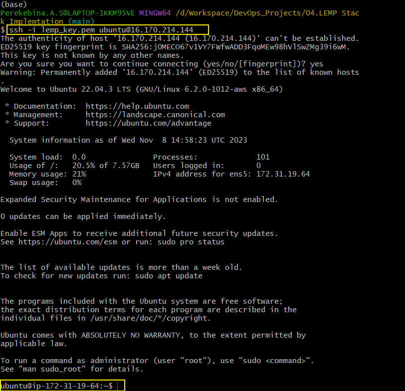

## Nginx Installation
The packages are updated using the `sudo apt update`, while Nginx is installed using `sudo apt install nginx` which is the web server for the project. To confirm if the installation is active the command `sudo systemctl status nginx`

For the web server to receive traffic, the port has to be opened on the EC2. In this project, TCP port 80 is used which is the default port. To check if it can be accessed locally using Ubuntu shell the `curl` command is used. `curl http://localhost:80`
To test if the Nginx server can respond to request from the Internet, we use the code `http://16.170.214.144:80`
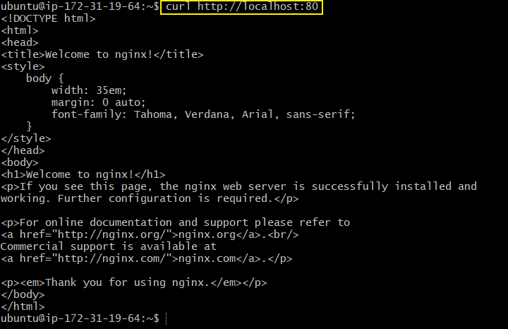

## MySQL Installation
After installing the web server, the next step is to install the database management system which helps in storing and managing data. The code for MySQL installation is ` sudo apt install mysql-server`

The installation of MySQL goes through an additional process to remove some insecure default settings and lock down access to your database system.
`ALTER USER 'root'@'localhost' IDENTIFIED WITH mysql_native_password BY 'PassWord.1';`

To acess MySQl use the code `sudo mysql -p`

## PHP Installation
PHP is needed to process and generate dynamic content for the web server. The PHP installation to communicate with Nginx which needs an external process linking both tools. The tool "PHP fastCGI process manager" is needed for this purpose. For PHP to also communicate with MySQL an addition item is added in the installation.
`sudo apt install php-fpm php-mysql`
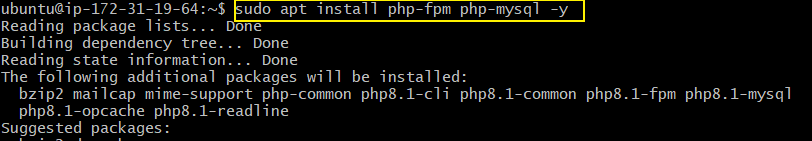

Several server blocks are created to host more than one domain on a single server. using the process below.
A directory is created containing a blank file, a configuration is written on the blank file. It is then tested and confirmed if the installation is successful.
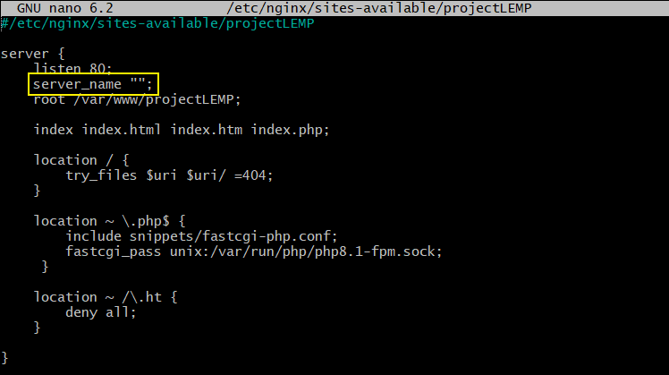
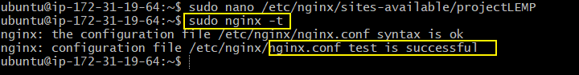

Upon confirmation of the website, and index.html file is created in the file location to test the server functionality using the `echo`
code to write on in the file and `http://16.170.214.144:80` to test the website on a browser
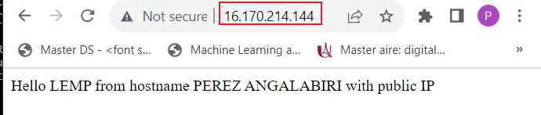

To test the functionality of the PHP on Nginx, a PHP file is created on the folder. using the code `nano /var/www/projectLEMP/info.php`
A code block is added to the php file `<?php
phpinfo();` and it is validated on the browser.
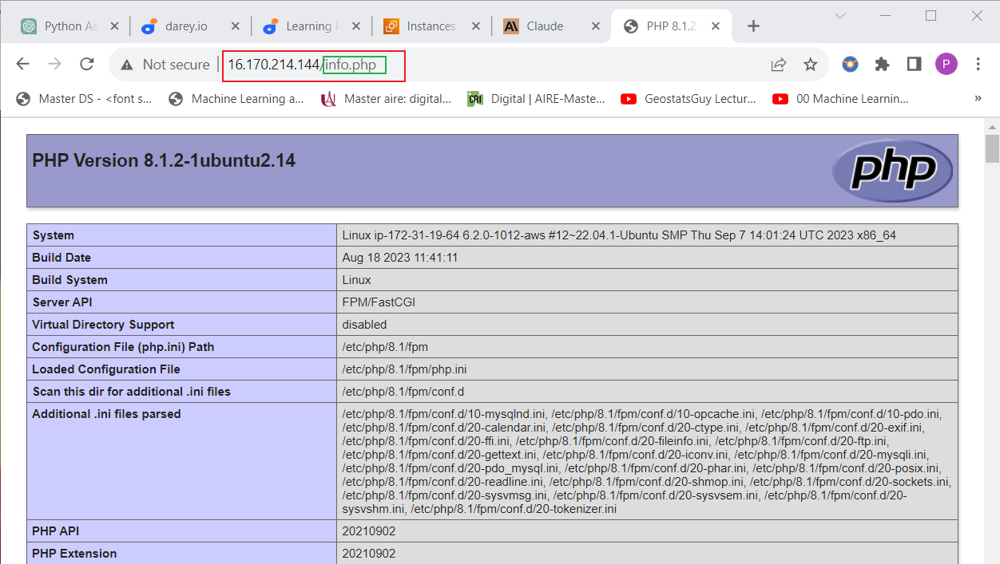

## MySQL Database with PHP
To explore the communicating between PHP and MySQL, a database is created using the code ``mysql> CREATE DATABASE `example_database`;``
To display the database, the code is `mysql> SHOW DATABASES;`
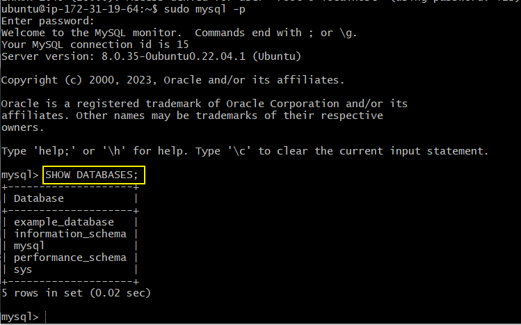
The database is tested using a different created table and adding data to the table using the codes
`CREATE TABLE example_database.todo_list (item_id INT AUTO_INCREMENT,content VARCHAR(255),PRIMARY KEY(item_id));`
and 
`mysql>  SELECT * FROM example_database.todo_list;`

A block of code is written to connect PHP to MySQL, then it is virtualized in the web browser using the IP address and php file name and extension.

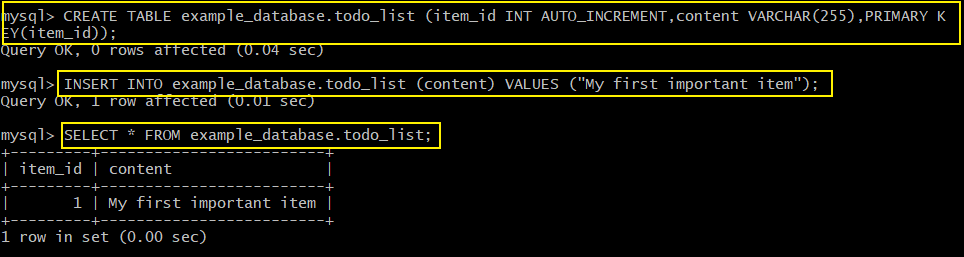

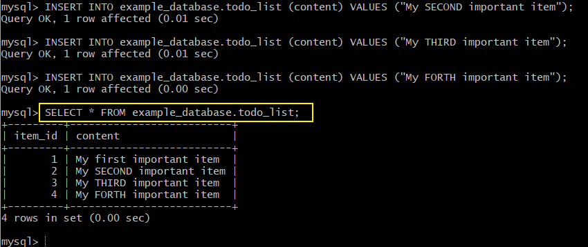

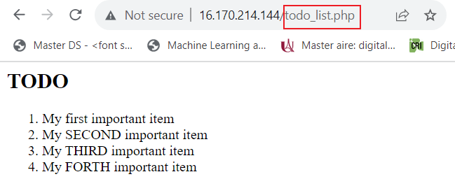