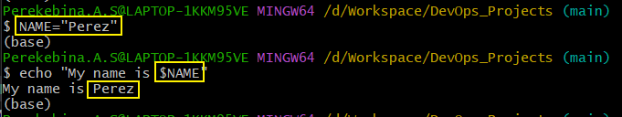
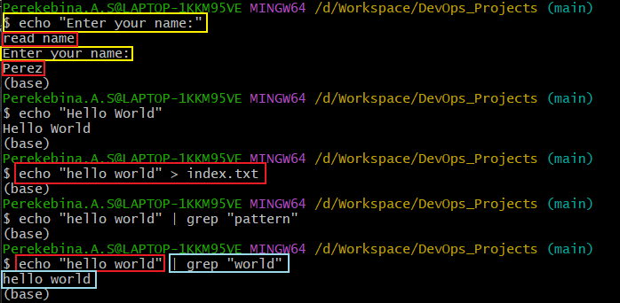
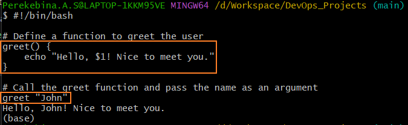
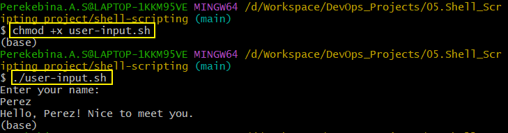
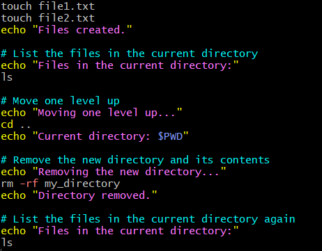
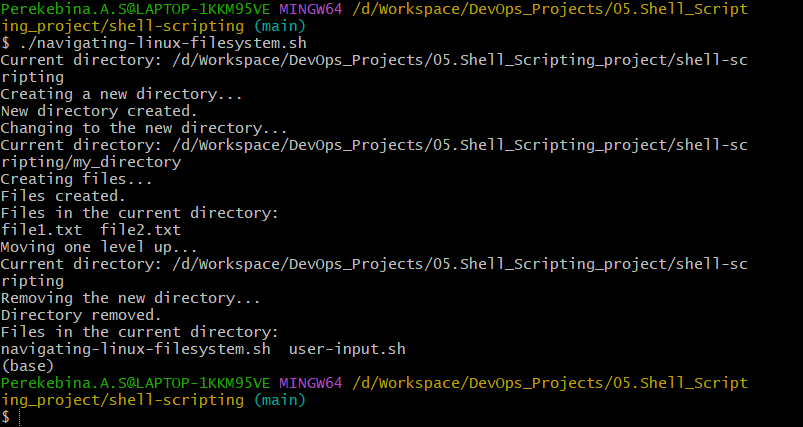
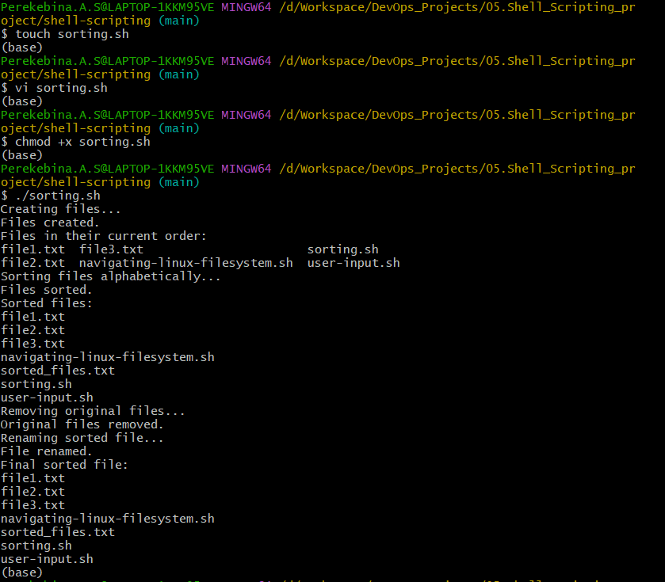

# SHELL SCRIPTING PROJECT
A shell script is a text file that contains a series of commands written in a scripting language for a command-line interpreter, or shell. Shell scripts are used to automate tasks, execute commands, and perform various operations on a Unix-like operating system.

## Shell Scripting Elements
Below are the different elements used in shell scripting;

- VARIABLE: Variables are used to store and manipulate data within a script. They provide a way to assign a name to a value and reference that value throughout the script. Variables can hold text strings, numbers, or other data types. The = is used assigning value to a variable and $(variable name) is used retrieving value from a variable.  
`name="John"`   
`echo "My name is $NAME"`

- CONTROL FLOW: Control flow refers to the order in which statements or commands are executed in a program. It dictates how a program progresses from one instruction to the next, based on certain conditions or decision points. Examples include Conditional Statements (if, elif, else), Loops (for, while).   
The line `#!/bin/bash` is called a shebang (or hashbang),  is used to specify the path to the interpreter that should be used to execute the script. 
In this case, it indicates that the Bash shell should be used to interpret the script.
`read -p "Enter a number: " num`: Asks the user to enter a number and stores it in the variable num.   
`if ((num > 0)); then`: Checks if the number is greater than 0.     
`elif ((num < 0)); then`: Checks if the number is less than 0.  
`else`: If none of the above conditions are true, it means the number is 0.
`echo`: Prints the result based on the condition met.    
`if`: it is used to close the statement.

    `for ((i=1; i<=5; i++))`: Initializes i to 1; continues as long as i is less than or equal to 5; increments i after each iteration.     
`do`: Marks the beginning of the code block to be executed in each iteration.   
`echo $i`: Prints the current value of i.   
`done`: Marks the end of the code block for the for loop.

- COMMAND SUBSTITUTION: Command substitution is a feature in shell scripting that allows you to capture the output of a command and use it as part of another command or assign it to a variable. In Bash, command substitution can be achieved using backticks (``) or the $() syntax.
current_date=`date +%Y-%m-%d`    
This line uses command substitution to capture the output of the date command with a specific format %Y-%m-%d, representing the year, month, and day.   

    `$(date +%Y-%m-%d)`: This part uses command substitution to capture the current date in the format specified by %Y-%m-%d.The result is assigned to the variable current_date.
    
    `echo "Today's date is $current_date"`: This line then prints a message including the captured date.
    

- INPUT AND OUTPUT: user input is obtained using the read command, allowing the script to capture information directly from the user during execution. The collected input can then be stored in variables for further processing. On the other hand, output is typically displayed to the user through the echo command, allowing the script to present messages, results, or any information to the user.  
`echo "Enter your name:"`: This line prints the message "Enter your name:" to the terminal, prompting the user to input their name.
    
    `read name`: The read command is used to capture the user's input, in this case, their name, and stores it in the variable name.     
    `echo "hello world"`: This part prints the text "hello world" to the standard output.    
    `> index.txt`: The > symbol is used for output redirection. It takes the output of the preceding command (in this case, "hello world") and writes it to a file called index.txt. If the file doesn't exist, it will be created; if it does exist, it will be overwritten with the new content.   
    `|`: The pipe (|) symbol is used for sending the output of one command as the input to another command.  
    `grep "world"`: The grep command searches for the specified pattern, in this case, "world," in the input it receives through the pipe. So, it will print "hello world" and then use grep to find and display lines containing the pattern "world" from that output.

- FUNCTION: a function is a set of commands grouped together to perform a specific task. Functions improve code organization, readability, and reusability.  
The script defines a function named greet using the syntax `greet()` {...}.
This function takes one parameter, denoted as `$1`, representing the name of the user.
Function Call: The script calls the greet function and passes the name "John" as an argument.    
`echo "Hello, $1! Nice to meet you."`    
`greet "John"`    
The function then echoes a greeting message including the provided name.

## Shell Script
To create the shell script, I first create a directory using `mkdir shell-scripting`. I create a file called user-input.sh using `touch user-input.sh`
input was made into the using `vi` command.  
`#!/bin/bash`: This is the shebang line, indicating that the script should be interpreted using the Bash shell.  
`echo "Enter your name:"`: Prints the message "Enter your name:" to the terminal, prompting the user to input their name.    
`read name`: The read command is used to capture the user's input and store it in the variable name.     
`echo "Hello, $name! Nice to meet you."`: Displays a greeting message using the entered name.

### Directory Manipulation and Navigation
The second script demonstrates basic operations like creating directories, files, navigating between directories, and cleaning up by removing the created directory and its contents. the file was create using `touch navigating-linux-filesystem.sh`

I added the following content into the file using `vi navigating-linux-filesystem.sh`

`echo "Current directory: $PWD"`: Displays the current working directory.    
`echo "Creating a new directory..."`: Prints a message about creating a new directory.   
`mkdir my_directory`: Creates a directory named my_directory.     
`echo "New directory created."`: Notifies that the new directory has been created.   
`echo "Changing to the new directory..."`: Prints a message about changing to the new directory.     
`cd my_directory`: Changes the current working directory to my_directory.    
`echo "Current directory: $PWD"`: Displays the updated current working directory.    
`echo "Creating files..."`: Prints a message about creating files.   
`touch file1.txt` and `touch file2.txt`: Creates two empty files named file1.txt and file2.txt.  
`echo "Files created."`: Notifies that the files have been created.  
`echo "Files in the current directory:`" and ls: Lists the files in the current directory.   
`echo "Moving one level up..."`: Prints a message about moving up one directory level.   
`cd ..`: Moves up one directory level.   
`echo "Current directory: $PWD"`: Displays the updated current working directory.    
`echo "Removing the new directory..."`: Prints a message about removing the new directory.   
`rm -rf my_directory`: Removes the directory my_directory and its contents recursively.  
`echo "Directory removed."`: Notifies that the directory has been removed.   
`echo "Files in the current directory:`" and ls: Lists the files in the current directory after the cleanup.

### File Opeartions and Sorting
The script demonstrates basic file manipulation operations, including creation, sorting, removal, and renaming, providing a simple illustration of file handling in a Bash script.   
`echo "Creating files..."`: Prints a message about creating files.
Creates three files (file1.txt, file2.txt, file3.txt) with content using echo and the redirection operator (>).  
`echo "Files in their current order:"`: Prints a message about displaying files.     
`ls`: Lists the files in their current order.    
`echo "Sorting files alphabetically..."`: Prints a message about sorting files.  
`ls | sort > sorted_files.txt`: Sorts the file names alphabetically and redirects the sorted list to a file named sorted_files.txt.  
`echo "Sorted files:"`: Prints a message about displaying sorted files.
`cat sorted_files`.txt: Displays the content of the sorted file.
`echo "Removing original files..."`: Prints a message about removing the original files.
`rm file1.txt file2.txt file3.txt`: Removes the original files.
`echo "Renaming sorted file..."`: Prints a message about renaming the sorted file.
`mv sorted_files.txt sorted_files_sorted_alphabetically.txt`: Renames the sorted file to a more descriptive name.
`echo "Final sorted file:"`: Prints a message about displaying the final sorted file.
`cat sorted_files_sorted_alphabetically.txt`: Displays the content of the renamed and sorted file.

## Working with Numbers and Calculations

THis script performs the basic and slightly more complex arithmetic operations using variables and then display the results.
`num1=10 and num2=5`: Define two variables (num1 and num2) with numeric values.
Basic arimethic calculations are performed using `(+, -, *, /, %)` using the defined variables. The results is stored in variables (sum, difference, product, quotient, remainder).

More complex calculations are done using `power_of_2=$((num1 ** 2))`: Calculate the square of num1 and store the result in power_of_2. `square_root=$(echo "sqrt($num2)" | bc)`: Use the bc (calculator) command to calculate the square root of num2 and store the result in square_root. The final result is dispalayed using `echo`.
.

## File Backup and TimeStamping
This script creates a backup of all files from a specified source directory to a backup directory.

`source_dir="/path/to/source_directory"`: Specifies the source directory that contains the files to be backed up.    
`backup_dir="/path/to/backup_directory"`: Specifies the backup directory where the files will be copied.     
`timestamp=$(date +"%Y%m%d%H%M%S")`: Generates a timestamp using the current date and time in the format "YearMonthDayHourMinuteSecond".     
`backup_dir_with_timestamp="$backup_dir/backup_$timestamp"`: Constructs the backup directory path by appending the timestamp to the backup directory.    
`mkdir -p "$backup_dir_with_timestamp"`: Creates the backup directory along with any necessary parent directories (-p flag).     
`cp -r "$source_dir"/* "$backup_dir_with_timestamp"`: Recursively copies all files from the source directory to the backup directory.
`echo "Backup completed. Files copied to: $backup_dir_with_timestamp"`: Prints a message indicating that the backup process is complete and specifies the destination directory.