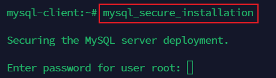
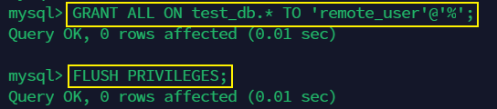

# Implement a Client Server Architecture using MySQL Database Management System (DBMS)

## Introduction to Basic Client-Server Project using MySQL RDBMS

In the realm of database management, the client-server architecture is a fundamental concept where a centralized server hosts a database, and clients interact with it to perform various operations. MySQL, a popular relational database management system (RDBMS), serves as an excellent foundation for creating such client-server applications.

## Project Overview:
The basic client-server project with MySQL involves setting up a MySQL server to host a relational database and creating one or more clients that connect to the server to perform operations such as data retrieval, insertion, updating, and deletion.

The steps to create a basic client-server using MySQL RDBMS are as follows.

-1 Two virtual servers where created, one for the client and the other for the server.

-2 The servers are connected using Termius and mysql is installed.

-3 `mysql-server` was installed in one of the instance while `mysql-client` was installed in the other server.

mysql was setup to have the secure installations using

-4 A database was created with full privileges.

The MySQL server is configured to allow connections from the remote host using `sudo vi /etc/mysql/mysql.conf.d/mysqld.cnf` where the bing address is changed to '0.0.0.0'

To confirm that MySQL server has been successful, MySQL is accessed using `sudo mysql -u remote_user -h 172.31.47.40 -p` and `show databases;` is used to display the available databases.

