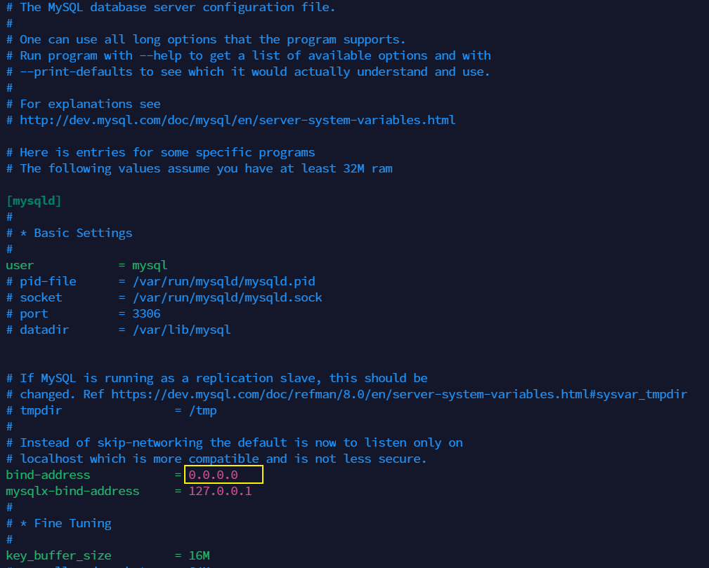

# Implement a Client Server Architecture using MySQL Database Management System (DBMS)

The steps to create a basic client-server using MySQL RDBMS are as follows.

-1 Two virtual servers where created, one for the client and the other for the server.

-2 The servers are connected using Termius and mysql is installed. 

The MySQL server is configured to allow connections from the remote host using `sudo vi /etc/mysql/mysql.conf.d/mysqld.cnf` where the bing address is changed to '0.0.0.0'

To confirm that MySQL server has been successful, MySQL is accessed using `mysql -p` and `show databases;` is used to display the available databases.

