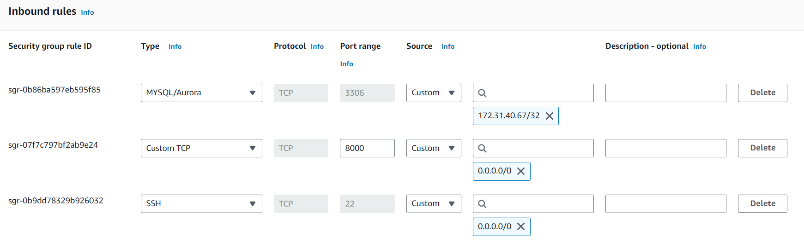
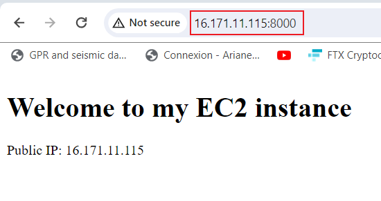

# Implementing Loadbalancers with NGINX

## Introduction

Load balancing is a critical component in modern web architectures, serving as a key mechanism to distribute incoming network traffic across multiple servers. This ensures optimal resource utilization, improves system performance, and enhances overall reliability and fault tolerance. NGINX, a powerful and widely used web server, also excels as a load balancer, providing efficient distribution of requests among backend servers.

NGINX load balancing operates at the application layer (Layer 7) of the OSI model, allowing it to make intelligent routing decisions based on various factors such as server health, response times, and content-based rules. This flexibility makes NGINX suitable for various scenarios, from distributing web traffic in a high-traffic website to load balancing microservices in a containerized environment.

## Workflow

The workflow for this project are as follows:

1. The first step is provisioning two EC2 instance on AWS management console. port 8000 was opened at the security group of both webservers.

2. Apache webserver is installed in both servers using `sudo apt update -y &&  sudo apt install apache2 -y`

3. The apache2 webserver is confirmed if is currently running using. `sudo apt update -y &&  sudo apt install apache2 -y`

4. The default port is port 80, the apache webserver is reconfigured to port 8000 to serve content using `sudo nano /etc/apache2/ports.conf` and `sudo nano /etc/apache2/sites-available/000-default.conf`

4. Creating a new html file containing the dispolay of the IP on the AWS instance using `sudo vi index.html`

6. The ownership of the html file is changed using `sudo chown www-data:www-data ./index.html`, to overide the default html file the code `sudo cp -f ./index.html /var/www/html/index.html` is used and the webserver is restarted using `sudo systemctl restart apache2`

5. A new instance is created as the loadbalancer using ubuntu then port 80 is opened.

6. nginx is installed to the instance using `sudo apt install nginx -y`

7. The loadbalance was configured using `sudo vi /etc/nginx/conf.d/loadbalancer.conf`. This NGINX configuration creates a basic load balancer that distributes incoming requests between two specified backend servers. It enhances the distribution of traffic and provides high availability for the web application. Adjustments can be made based on specific requirements and the number of backend servers.

8. nginx test is conducted using `sudo nginx -t`

9. Using the loadbalancing IP `http://13.48.25.226/`, the result returns the display of a backend server.

