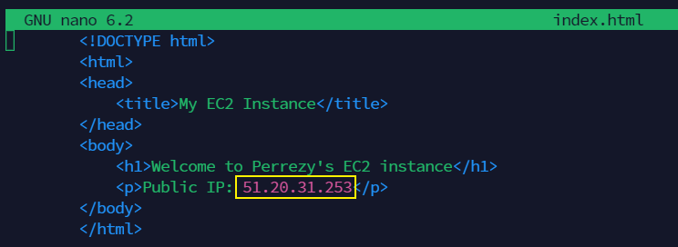
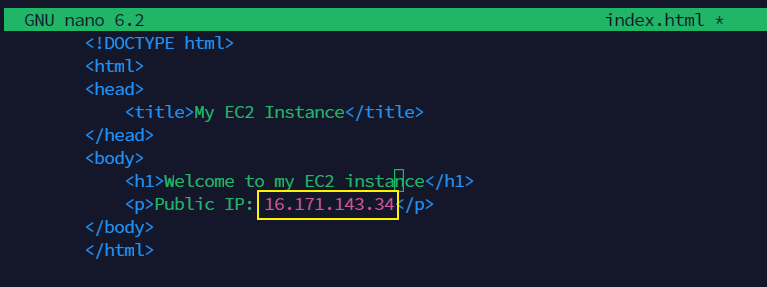

# Deployment of Nginx as a Load Balancer Using Shell script

## Introduction
Deployment of Nginx as a Load Balancer using a shell script involves automating the installation, configuration, and setup of Nginx to act as a load balancer for distributing incoming network traffic across multiple backend servers. This scripting approach streamlines the deployment process, making it more efficient and reproducible.

A shell script typically includes commands and configurations that install Nginx, set up the required configurations for load balancing, and start the Nginx service. By using a shell script, administrators can easily replicate the deployment across multiple environments, ensuring consistency and reducing the likelihood of errors in the configuration.

This automated deployment is particularly useful in scenarios where organizations need to scale their web applications by distributing the incoming requests among multiple servers. Nginx, with its robust load balancing capabilities, can significantly enhance the performance, reliability, and scalability of web applications.

## Workflow
The workflow for this project are as follows:

1. The first step is provisioning two EC2 instance on AWS management console. port 8000 was opened at the security group of both webservers.

2. Apache webserver is installed in both servers using `sudo apt update -y &&  sudo apt install apache2 -y`

3. The default port is port 80, the apache webserver is reconfigured to port 8000 to serve content using `sudo vi /etc/apache2/ports.conf`
Then change port 80 to 8000 using `sudo nano /etc/apache2/sites-available/000-default.conf`
 
 

 4. Creating a new html file containing the dispolay of the IP on the AWS instance using `sudo vi index.html`
 
 

5. The ownership of the html file is changed using `sudo chown www-data:www-data ./index.html`, to overide the default html file the code `sudo cp -f ./index.html /var/www/html/index.html` is used and the webserver is restarted using `sudo systemctl restart apache2`

6. The automation script for the servers is created using the `sudo nano install.sh`, to make the script executable, I used `sudo chmod +x install.ch` and finally run the script using `./install.sh 51.20.31.253`

The extracts of the final result of the automated servers are shown below

7. A new instance is created as the loadbalancer using ubuntu then port 80 is opened. nginx is installed to the instance using `sudo apt install nginx -y`

8. The loadbalance was configured using `sudo vi /etc/nginx/conf.d/loadbalancer.conf`. This NGINX configuration creates a basic load balancer that distributes incoming requests between two specified backend servers. It enhances the distribution of traffic and provides high availability for the web application. Adjustments can be made based on specific requirements and the number of backend servers.

9. nginx test is conducted using `sudo nginx -t`

10. an nginx script is created with the automation code using `sudo nano nginx.sh`

11. The script was made executable using the code `sudo chmod +x nginx.sh` then ran using the code `./nginx.sh 16.171.206.241 51.20.31.253 16.171.143.34`

Final display of the loadbalancer using the automated script.

