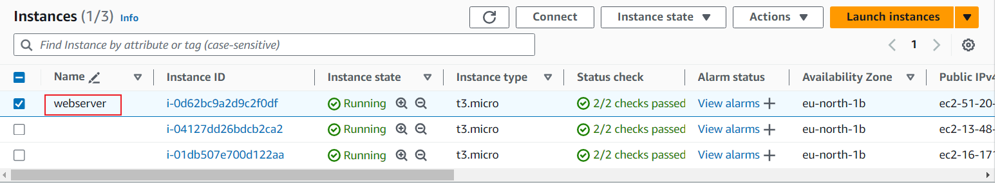
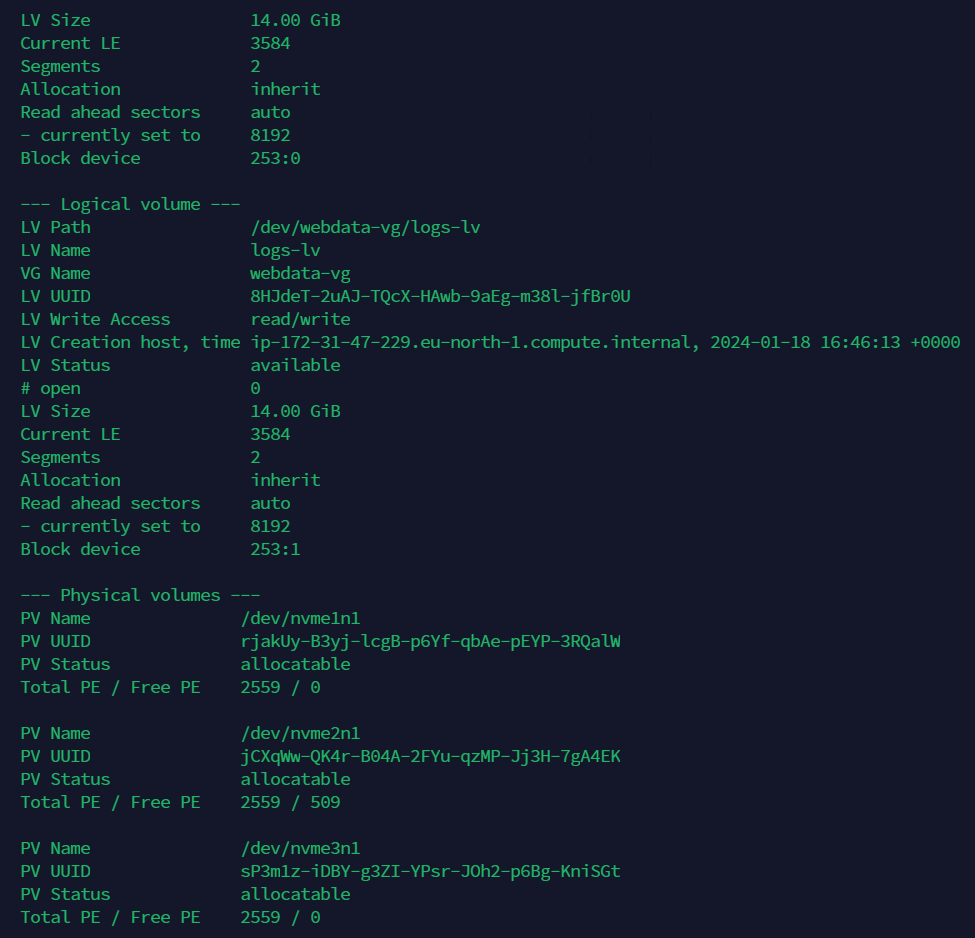
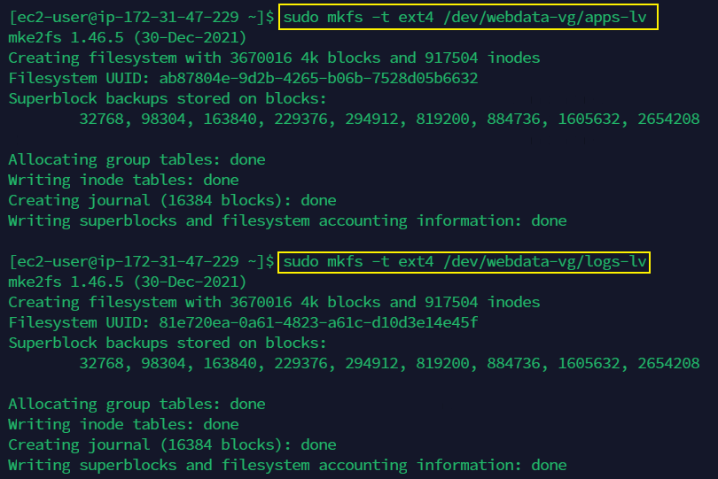
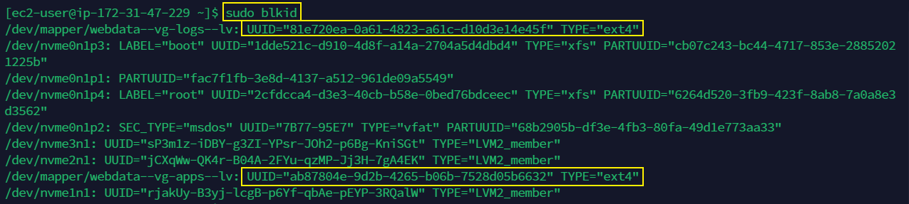
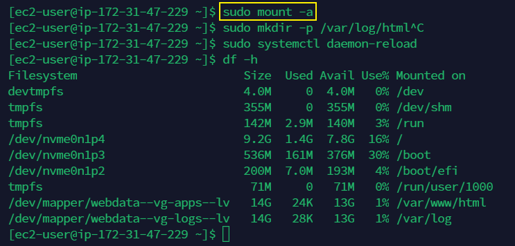
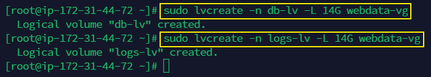
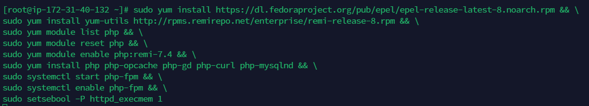

# Implementing Wordpress Website with LVM Storage Management

## Introduction

Implementing a WordPress website with LVM (Logical Volume Management) storage management is a strategic approach to enhance performance, scalability, and flexibility. LVM provides a dynamic and efficient way to manage disk space, allowing administrators to resize, move, and allocate storage resources without interrupting services. In the context of a WordPress website, this setup becomes particularly beneficial for handling the dynamic and growing nature of content.

## Workflow

1. Build an instance on AWS using redhat as the operating system and SSH as the key-pair which will be used as the webserver.

2. Three volumes where created using the type general purpose SSD (gp3), size 10 (GiB) and Availability Zone (eu-north-1b).

The volumes are all attached to the webserver.

3. The instance is confirmed if the volumnes have been added using `lsblk`, then  `ls /dev` is used to see a list of all block devices and partitions. Then `df -h` to see all mounts and free space in the server

4. To create a single partition on each of the three NVMe disks using `gdisk`,  I used `sudo gdisk /dev/nvme3n1`, `sudo gdisk /dev/nvme1n1` and `sudo gdisk /dev/nvme2n1`.

The volumes are formatted using `mkfs -t ext4 /dev/nvme1n1, mkfs -t ext4 /dev/nvme2n1, mkfs -t ext4 /dev/nvme3n1`

5. Next is to install LVM using `sudo yum install lvm2` the check for partitions using `sudo lvmdiskscan`

6. The `pvcreate` is used to mark each of the three disks as physical volumes using `sudo pvcreate /dev/nvme2n1`, `sudo pvcreate /dev/nvme1n1` and `sudo pvcreate /dev/nvme3n1`

`sudo pvs` is used to confirm if the physical volume has been created.

7. All physical volumes PV are added to a created volume group VG named webdata-vg using `sudo vgcreate webdata-vg /dev/nvme1n1 /dev/nvme2n1 /dev/nvme3n1` and verified using `sudo vgs`.

8. The `sudo lvcreate -n apps-lv -L 14G webdata-vg` and `sudo lvcreate -n logs-lv -L 14G webdata-vg` commands utilize the `lvcreate` tool to establish two logical volumes, namely `apps-lv`(used half of the PV size) and `logs-lv` (use the remaining space of the PV size), each allocated with a size of 14 gigabytes. These logical volumes are created within the volume group named `webdata-vg`. The app-lv is used to store data of the website while log-lv is used to store data of the logs.

9. The entire setup is confirmed using the command `sudo vgdisplay -v` and `sudo lvs`.

10. These commands format the logical volumes (`apps-lv` and `logs-lv`) within the `webdata-vg` volume group with the ext4 file system for storage use using `sudo mkfs.ext4 /dev/nvme1n1`, `sudo mkfs.ext4 /dev/nvme2n1`, and `sudo mkfs.ext4 /dev/nvme3n1`. 

11. These commands create directories for web content and recovery logs, then mount the logical volume `apps-lv` to the `/var/www/html/` directory for web content storage. `sudo mkdir -p /var/www/html`, `sudo mkdir -p /home/recovery/logs`, and `sudo mount /dev/webdata-vg/apps-lv /var/www/html/`.

12. This command uses `rsync` to synchronize the contents of the `/home/recovery/logs` directory with the `sudo mkdir -p /var/log/html` directory, ensuring that the logs from the recovery location are copied to the system's main log directory.

13. The entries in the /etc/fstab file are used to define how disk partitions, filesystems, or remote filesystems should be mounted into the file system hierarchy. The `sudo blkid` command is used to display information about block devices, including UUIDs (Universally Unique Identifiers)

The extracted UUID is added to the `sudo vi /etc/fstab`

`sudo mount -a` is used to test the configuration and 
`sudo systemctl daemon-reload` is used to reload the daemon.

14. The mounted `/var/www/html` and `/var/log` successfully, and the usage percentages indicate that there is sufficient space available on those mounts.

15. The DB Server is configured just like the webserver following the same process.

17. The command `sudo mkfs -t ext4 /dev/webdata-vg/logs-lv` and `sudo mkfs -t ext4 /dev/webdata-vg/db-lv` is used to format the volumes. This command `sudo /db` creates a directory named /db as the mount point for the database logical volume.
sudo mkdir -p var/www/db
sudo mkdir -p /var/log
sudo mount /dev/webdata-vg/logs-lv /db
sudo mkdir -p /home/recovery/logs/log
sudo mount /dev/webdata-vg/db-lv /home/recovery/logs
sudo rsync -av /db/. /var/log
sudo rsync -av /home/recovery/logs/. /var/log

18. installing wordpress follows updating the OS using `sudo yum -y update`. The command `sudo yum -y install wget httpd php php-mysqlnd php-fpm php-json` installs essential web server components, including wget, Apache HTTP Server (httpd), and PHP with MySQL support and JSON extension, using the yum package manager.
The `sudo systemctl enable httpd` and `sudo systemctl start httpd` are used to enable and start the Apache HTTP Server (httpd) on the system using systemctl.

19. This single command sequence installs EPEL and Remi repositories, lists PHP modules, resets the PHP module, enables PHP 7.4 from Remi, installs PHP and required extensions, starts and enables PHP-FPM, and sets SELinux boolean for Apache execution.

20. Created a directory named "wordpress," navigated into it, and downloaded the latest WordPress package using `mkdir wordpress` and `cd   wordpress` and 
`sudo wget http://wordpress.org/latest.tar.gz`

21. `sudo tar xzvf latest.tar.gz`
`sudo rm -rf latest.tar.gz`
`cp wordpress/wp-config-sample.php wordpress/wp-config.php`
`cp -R wordpress /var/www/html/`
These commands extract the WordPress files, remove the compressed archive, create a wp-config.php file from the sample, and copy the entire WordPress directory to the /var/www/html/ location.

The command `sudo chown -R apache:apache /var/www/html/wordpress` is used to set the ownership of the WordPress directory to the Apache user and group, the `sudo chcon -t httpd_sys_rw_content_t /var/www/html/wordpress -R` is used to apply SELinux context for read-write access. The command `sudo setsebool -P httpd_can_network_connect=1` is used to allow Apache to make network connections and `sudo setsebool -P httpd_can_network_connect=1` is used to ensuring proper permissions and security for the WordPress installation.

22. The MySQL is installed on the database server using `sudo yum install mysql-server`, `sudo systemctl restart mysqld`, `sudo systemctl enable mysqld`. These commands restart the MySQL service and enable it to start automatically on system boot.

23. These commands access the MySQL command-line interface, create a WordPress database, define a user with specific privileges, flush privileges, display databases, and exit the MySQL environment.

27. The mysql in the database server is accessed from webserver. 

28. Some configurations are done to access wordpress on the web.

